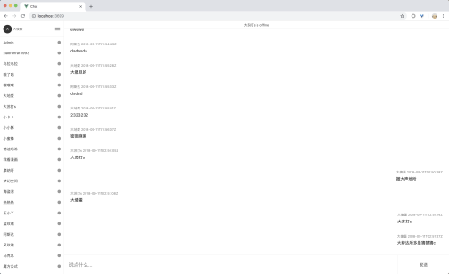

# vue-chat

> [CHATKIT](https://dash.pusher.com/chatkit)

## 截图




## Usage

```
git clone git@github.com:xrr2016/vue-chat.git

yarn install
```

### 启动

```
yarn  build

yarn run server
```

### 前端开发

```
yarn run serve
```

### Build

```
yarn run build
```

### Lint

```
yarn run lint
```

## Licence

[MIT](./License)
